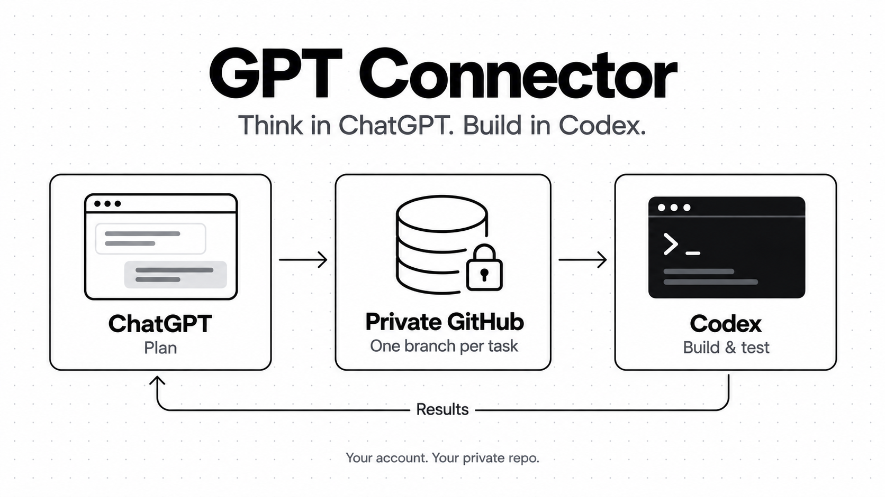

# GPT Connector

网页 GPT 想方案，Codex 写代码。用你自己的 GitHub 私有仓库交接，不用复制整段方案。



## 下载

```sh
git clone -b main https://github.com/yusenthebot/planrelay.git gpt-connector
cd gpt-connector
uv sync --locked
```

需要 Python 3.12+、[uv](https://docs.astral.sh/uv/getting-started/installation/) 和 GitHub CLI（`gh`）。

下载不等于安装。首次需要完成双端 MCP 连接、私有仓库授权和项目背景绑定；这是一次性设置，不是每个任务的步骤。

## 日常使用（新版目标）

当前版本尚未实现下面的完整双端 MCP 用法，不能当作已可用的操作指南。现有版本见[详细说明](docs/advanced.md)。

### 1. 直接在网页 GPT 想方案

启用 GPT Connector，直接说需求，不用先去 Codex 对话：

> 我想增加一个登录功能，先帮我规划。

方案满意后说：

> 就按这个方案，交给 Codex。

GPT 调用插件把方案保存到你的私有 GitHub 仓库，每个新任务一个独立的交接 branch。

### 2. 在 Codex 提到插件就接手

在已绑定项目的 Codex 对话里说：

> gpt-connector，接收任务并开始开发、测试，完成后回传结果。不要提交、推送或部署业务代码。

插件找到待办方案，Codex 接着做。不用复制方案或手填任务编号；有多个待办时，先让你选一个。

### 3. 回网页看结果

> 用 GPT Connector 看一下结果。

以后就这样重复：网页规划 → Codex 接手 → 网页看结果。提到插件才接手，不会在后台擅自启动开发。

[详细说明](docs/advanced.md) · [完整 prompts](docs/prompts.md)
